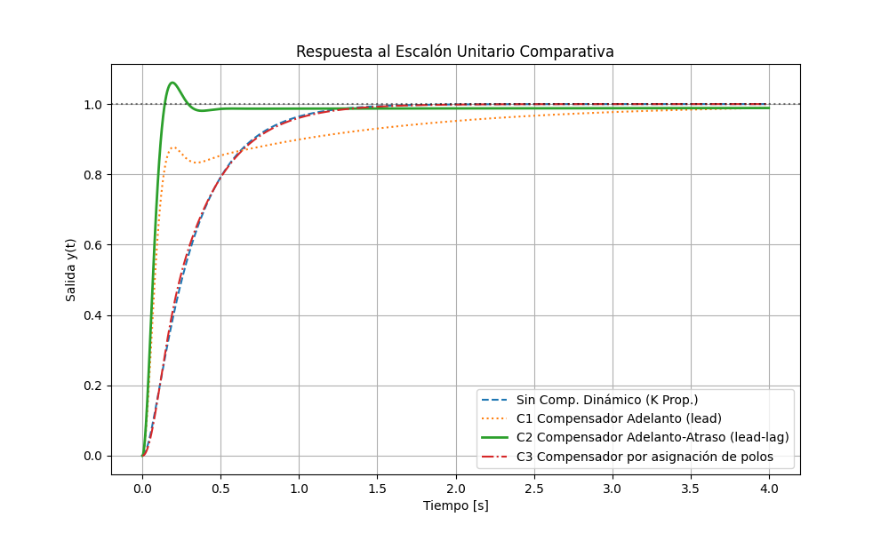
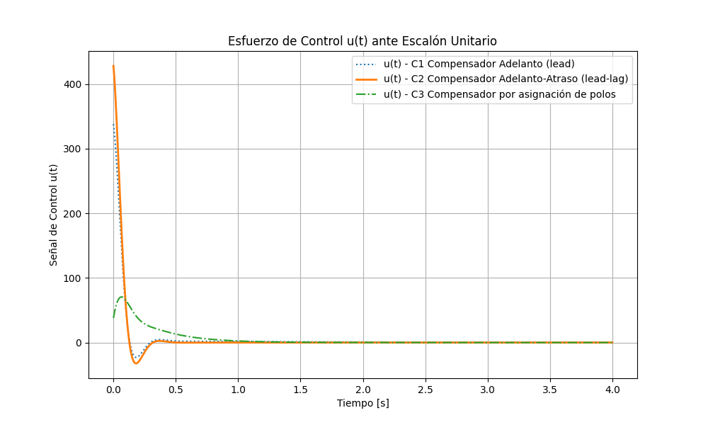

# Trabajo Práctico Integrador — Instrumentación y Control de Procesos

---

## Universidad Tecnológica Nacional
### Facultad Regional Córdoba

**Licenciatura en Automatización y Control**  
**Autor:** Gonzalo Vera  
**Fecha de Entrega:** Mayo 2026  

---

Este repositorio contiene la resolución completa y formal del Trabajo Práctico Integrador de regularización de la asignatura **Instrumentación y Control de Procesos**. El objetivo del proyecto es compensar una planta dada para cumplir con especificaciones dinámicas y estacionarias en lazo cerrado con realimentación unitaria.

---

## 📄 Entregable Principal y Documentos de la Entrega

El trabajo práctico cuenta con dos documentos principales de entrega:

*   **[TP_Integrador_Vera.pdf](d_presentacion/TP_Integrador_Vera.pdf) (Informe Técnico Final)**: Documento formal compilado que detalla las consideraciones de diseño adoptadas, el desarrollo matemático paso a paso y la discusión técnica de las soluciones.
*   **[TP_Integrador.ipynb](TP_Integrador.ipynb) (Cuaderno Unificado de Simulación)**: Cuaderno Jupyter ejecutable en la raíz del proyecto que contiene los solucionadores numéricos, la verificación matemática de polos/ceros y la generación de todas las gráficas interactivas.

---

## 📁 Estructura del Repositorio

El proyecto está organizado en cuatro etapas correlativas de diseño:

1.  **[a_requisitos/](a_requisitos/README.md)**: Requisitos y consignas detalladas provistas por la cátedra. Contiene la definición matemática de la planta y las restricciones del diseño.
2.  **[b_investigacion/](b_investigacion/README.md)**: Cuadernos de investigación para el modelado temporal de sistemas de primer y segundo orden, y simulación de compensadores vía convolución numérica.
3.  **[c_prototipado/](c_prototipado/README.md)**: Biblioteca de funciones clásicas de control (`lib_coreControlClasico`), utilizada para graficar diagramas de Bode de estabilidad (márgenes de fase/ganancia) y Lugar Geométrico de las Raíces (LGR).
4.  **[d_presentacion/](d_presentacion/README.md)**: Cuadernos con el desarrollo de diseño individual para los compensadores **C1**, **C2** y **C3**, e informe formal final en PDF.

---

## 🎯 Especificaciones de Diseño de la Planta

La planta original a controlar es:
$$ G_p(s) = \frac{s + 40}{s(s + 25)(s + 35)} $$

El sistema compensado en lazo cerrado con realimentación unitaria debe verificar:
*   **Coeficiente de amortiguamiento relativo ($\zeta$):** $0.628$
*   **Frecuencia natural amortiguada ($\omega_n$):** $21.324 \text{ rad/s}$
*   **Constante de error de velocidad estacionaria ($K_v$):** $3 \text{ rad/s}$

El par de polos dominantes complejos deseados para cumplir con la respuesta transitoria es:
$$ s_d = -13.3915 \pm j 16.5944 $$

---

## ⚙️ Compensadores Diseñados

Se analizaron y contrastaron tres topologías de control:

1.  **C1 Compensador Adelanto (lead), de primer orden:**
    *   *Estructura:* $G_{c1}(s) = 337.94 \frac{s + 0.93}{s + 4.79}$
    *   *Observación:* Presenta un polo lento en lazo cerrado ($s \approx -0.74$) que domina la respuesta transitoria real, estirando el tiempo de asentamiento.
2.  **C2 Compensador Adelanto-Atraso (lead-lag), de segundo orden:**
    *   *Estructura:* $G_{c2}(s) = 428.01 \frac{(s+25)(s+0.05)}{(s+29.69)(s+0.276)}$
    *   *Observación:* La solución clásica recomendada. Cancela el polo lento en $-25$ de la planta dinámica mediante el cero del adelanto. Cumple con $K_v \approx 2.98$ rad/s.
3.  **C3 Compensador por asignación de polos, de segundo orden:**
    *   *Estructura:* $G_{c3}(s) = \frac{37.96 s^2 + 2277.87 s + 33218.99}{s^2 + 30.12 s + 506.19}$
    *   *Observación:* Presenta polos y ceros complejos conjugados. No responde a la topología clásica pero optimiza drásticamente la respuesta del polo no dominante y reduce el pico de esfuerzo de control inicial.

---

## 📈 Gráficas Representativas del Lazo Cerrado

### 1. Respuesta al Escalón Unitario Comparativa
Muestra la salida temporal de cada lazo cerrado. Se aprecia el retardo transitorio de C1 debido a su polo lento, frente a la respuesta ágil y libre de transitorios prolongados de C2 y C3:

### 2. Demanda del Esfuerzo de Control $u(t)$
Muestra la señal de control entregada al actuador físico. Se resalta la ventaja de C3, el cual exige un pico máximo de apenas $\approx 65$, representando una demanda de energía $6.6\times$ menor a los $\approx 428.01$ de C2:

---

## ⚖️ Licencia

Este proyecto está bajo una **licencia de uso exclusivamente académico y docente con reconocimiento**. Para conocer los términos detallados de copia, distribución, atribución y el agradecimiento formal a la cátedra de Instrumentación y Control de Procesos (UTN FRC), consulte el archivo [LICENSE](LICENSE).
