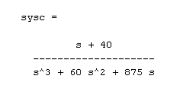

# TP Integrador
## Instrumentacion y Control 

Trabajo de Regularización de la materia Instrumentación y Control de procesos:

El objetivo del presente trabajo es que el estudiante demuestre las competencias adquiridas durante el desarrollo de la asignatura.
Para resolver la consigna podrá utilizar las herramientas informáticas que considere necesarias.
Solo se aceptarán trabajos completos, es decir aquellos que cumplan con todas las
exigencias del presente.
El trabajo deberá ser presentado con un informe en donde se detallen las herramientas utilizadas, las consideraciones de diseño adoptadas, los resultados obtenidos y las simulaciones de respuesta al escalón del sistema antes y luego de la compensación.
Además del informe, deberá acompañar la presentación con el archivo de simulación, que permita constatar que el sistema compensado cumple con los requerimientos
especificados, la simulación debe usar el modelo estándar del compensador y de la
planta.

Requerimientos:  
Dada la planta representada por la siguiente función de transferencia, usted debe
compensarla para que su respuesta tenga un coeficiente de amortiguamiento relativo (ζ) de 0.628 y una frecuencia natural amortiguada (ωn) de 21.324 radianes y una constante de error de estado estacionario de 3 rad/seg.


